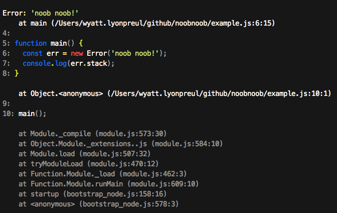

# noob noob

Useful stacktraces for development that include code highlighting.

[](https://travis-ci.org/geek/noobnoob)


## Usage

Either `require('noobnoob')` directly in your module or preload it with `-r`:

```sh
node -r noobnoob example.js
```

When an error's stack is formatted it will include useful details about the code that generated the error. Below is an example of the output from noob noob

[]


